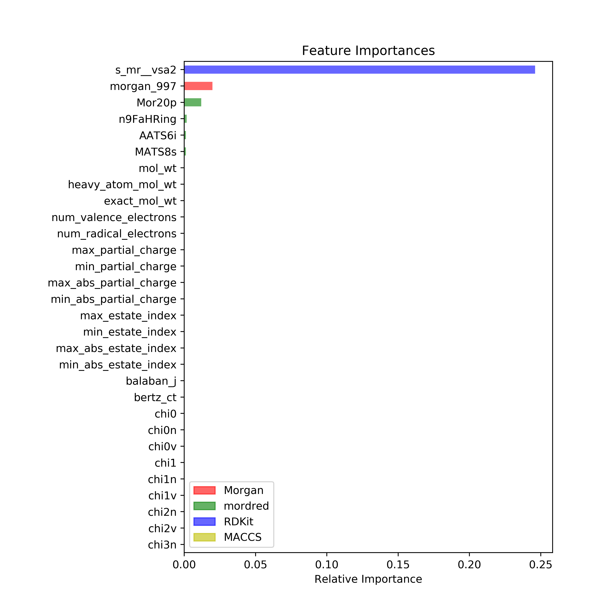
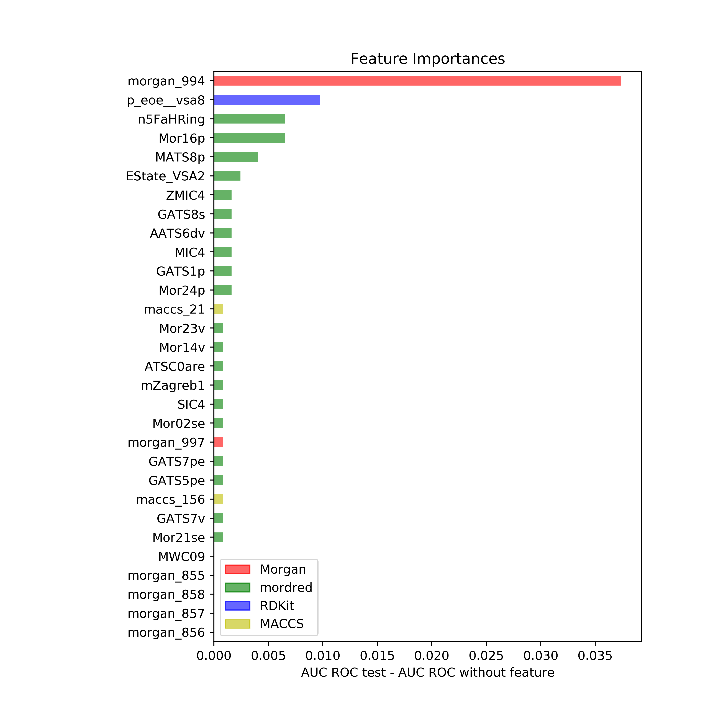
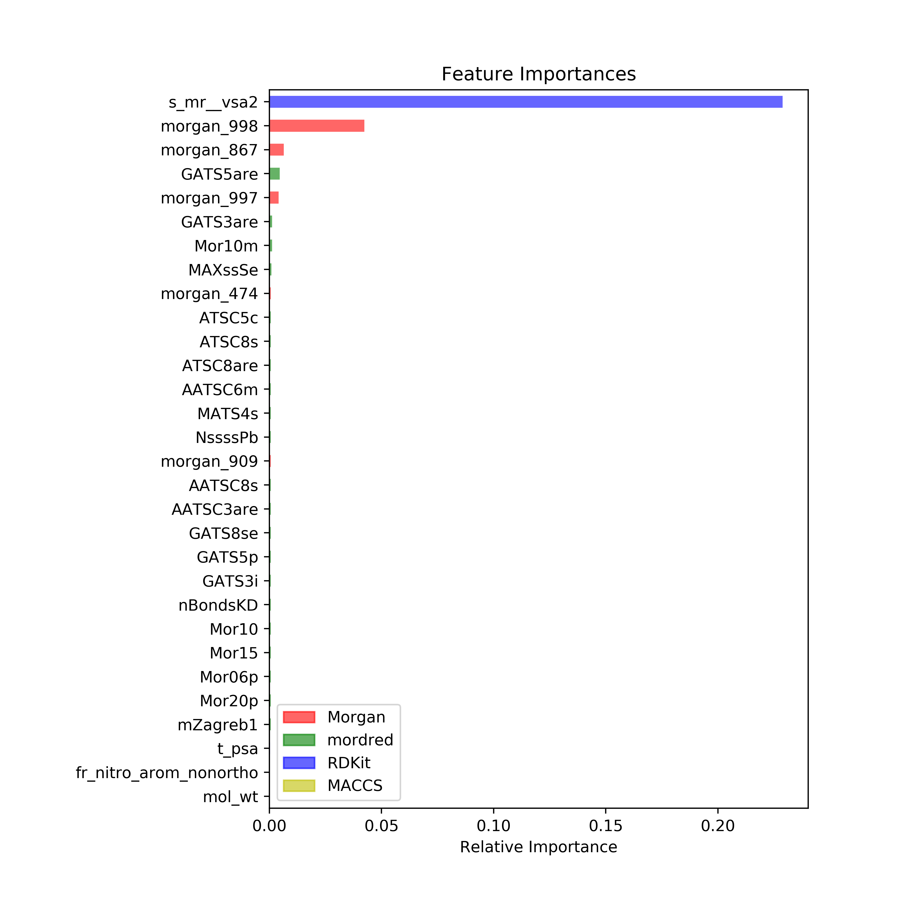
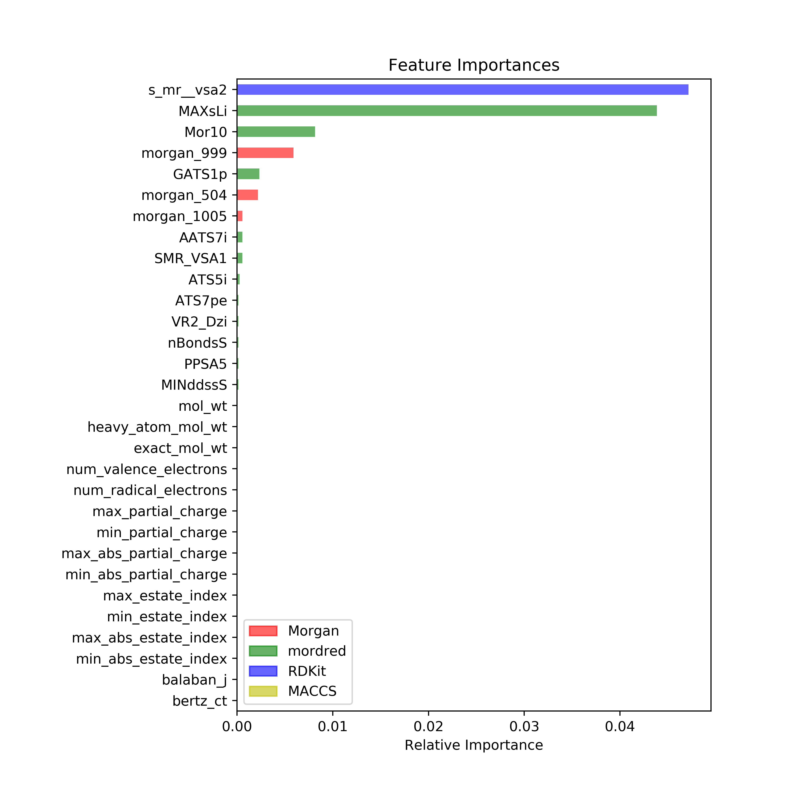
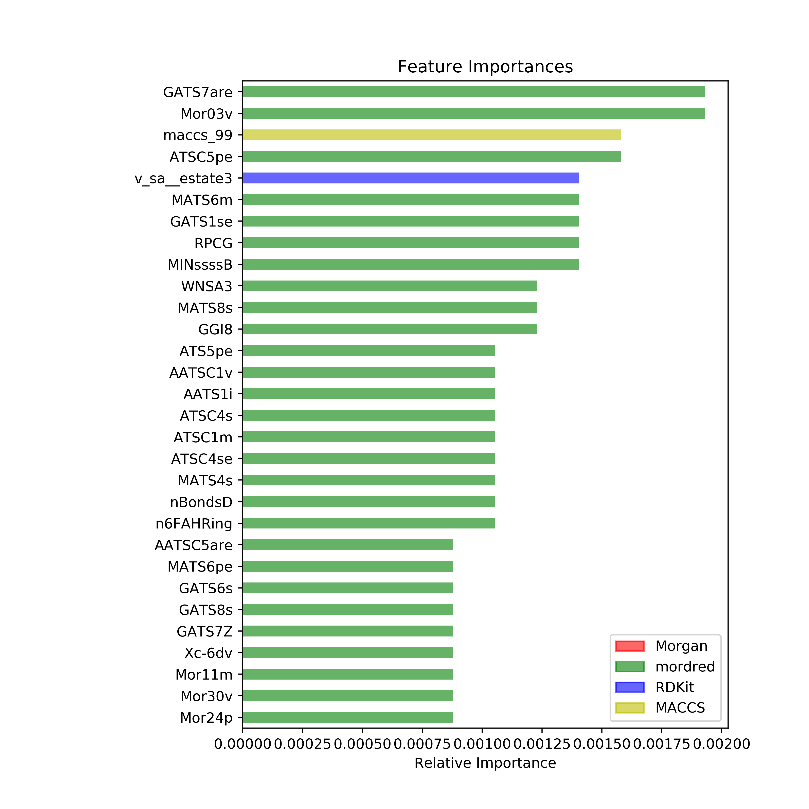
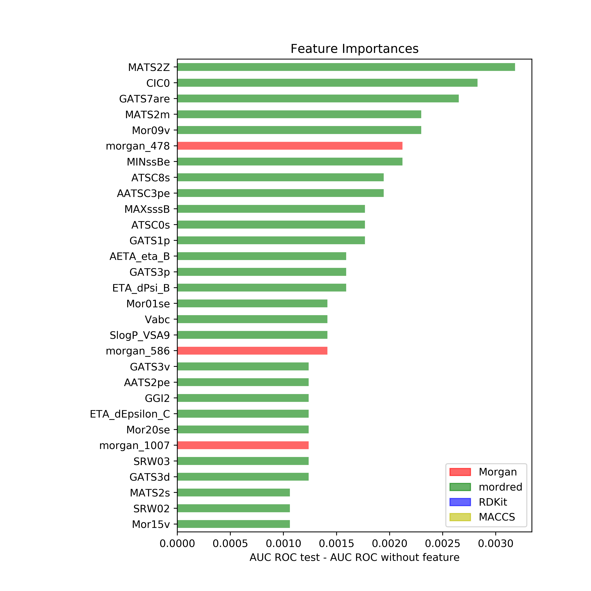
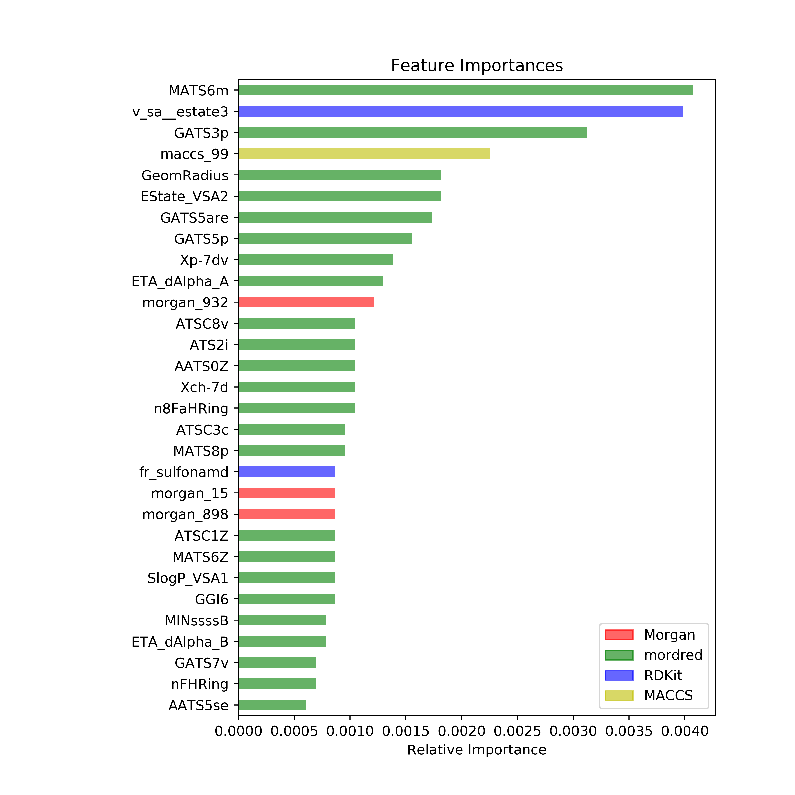
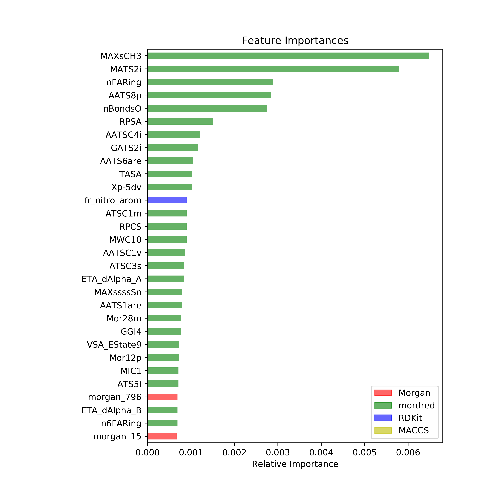

## Feature importance (XGBoost)
(Descriptors: ['rdkit', 'morgan', 'mordred', 'maccs'], n_bits: 1024)
### Clintox
#### Random
 
#### Stratified
 
#### Scaffold
 
#### Cluster
 

### BACE
#### Random
 
#### Stratified
 
#### Scaffold
 
#### Cluster
 
